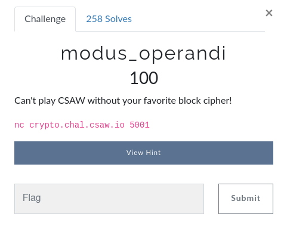
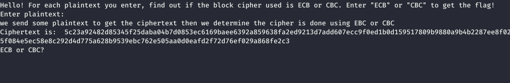
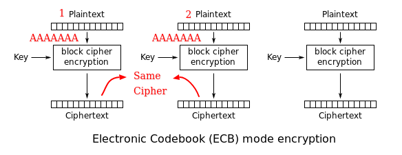
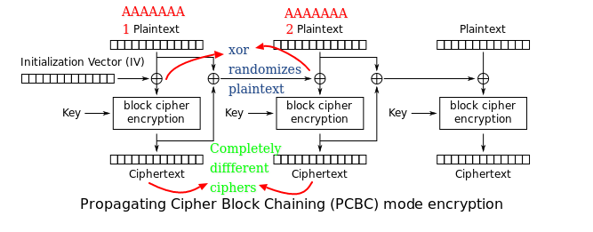

# csaw365

# modus_operandi



When we connect using netcat we get the following,



We are asked to enter plaintext which is then returned encrypted either in ECB ( Electronic Code Block ) or CBC ( Cipher Block Chaining ). 

## ECB

It is one of the simplest encryption modes, messages are divided into several blocks and the key is used to encrypt the message. The problem with this encryption is that if the blocks of text are repeated say the block 1 and block 2 are same then we will get the same cipher text for both the blocks. ( [https://en.wikipedia.org/wiki/Block_cipher_mode_of_operation](https://en.wikipedia.org/wiki/Block_cipher_mode_of_operation) )



## CBC

CBC has a different approach than ECB. First the plaintext is XOR'ed with the cipher of previous block of plaintext ( Initialization Vector for the first block which is a block of text same length as the block ). This ensures that before encryption under the key the plain text is randomized hence we will not get the same text even when we encrypt the same message. This hugely improves security.

( [https://en.wikipedia.org/wiki/Block_cipher_mode_of_operation](https://en.wikipedia.org/wiki/Block_cipher_mode_of_operation) )



We construct a function such that, we divide the ciphers into many chunks and see how many chunks are the same. When we encrypt same data, the cipher chunks will be repeated in ECB and will have no repeated in CBC.

```jsx
def find_repeating_blocks(cip: bytes) -> int:
    """ 
	 takes cipher, breaks them into chunks (blocks of text)
        and returns the number of repeated chunks
	 
	 text is divided into 16 bytes of data which is standard 
        for ECB

    param1: gets the cipher text
    returns the amount of repeated chunks 
    """

    chunk_tex = chunks(cip,16)
    
    repeat = len(chunk_tex) - len(set(chunk_tex))
    return(repeat)

def chunks(text:bytes,blocksize:int)->bytes:
    """
    pram1: whole encrypted messages 
    pram2: amount of chunks needed 
    return array of chunks of data
    """
    chunk_data = b''
    chunks = []
    for i in range(0,len(text),blocksize):
        chunk_data = text[i:i+blocksize] 
        chunks.append(chunk_data)
    return chunks
```

After playing with the challenge I found a few things, 

1. The challenge encrypts in a particular pattern (first its ECB then CBC then CBC).
2. When we try to do this manually (by manually typing in the plaintext and then sending it to above function ), even after many iterations we don't get the flag. We are going to have to do it with python.

## Netcat In Python

To implement this in python, after googling a bit I used the following code in my solution.

[Python Netcat](https://gist.github.com/leonjza/f35a7252babdf77c8421)

## Final Solution

Now we make the following python code, which sends a crafted plain text. Since the plaintext is just repeated 'A', the cipher will be same for ECB. After running the solution a few times I realized after 175  iteration the server returns empty string. After a few tries since there were two possibilities 'ECB' and 'CBC' and challenge encrypts in a particular pattern (first its ECB then CBC then CBC and so on). I recorded one's and zero's for ECB and CBC hoping it would be binary which when converted to string would give us the flag, It did.

```jsx
if __name__ == '__main__':
    nc = Netcat('crypto.chal.csaw.io', 5001)
    final = b''
    for i in range(200):
        
        print('I=',i)
        if i < 175:
            string = nc.read(256)
            print(string)

            #crafted plaintext which gives same cipher in ECB
            content = 'AAAAAAAAAAAAAAAA'*4 + '\n' 
            nc.write(content.encode())
            string = nc.read(256)
            
            if len(string) == 0:
                print('error')
                break
            string = str(string[16:-14]) 
            
            repeat = find_repeating_blocks(string)
            
            if repeat != 0:
                res = 'ECB'+ '\n'
                final = final + b'1'
            else:
                res = 'CBC'+ '\n'
                final = final + b'0'
            
            if i == 174:
                print(final)
            nc.write(res.encode())
```
